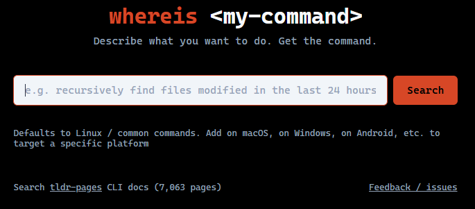

# whereis \<my-command\>



[](https://github.com/rick-does/whereis-my-command/actions/workflows/ci.yml)

Natural language search across [tldr-pages](https://github.com/tldr-pages/tldr) CLI documentation.

1. **No hallucination on commands** — every answer is grounded in tldr-pages documentation, so the commands are real and tested
2. **Structured, consistent output** — always a command, an explanation, and a source; no conversational filler
3. **Ranked alternatives** — 3–5 results ordered by commonality, from the standard answer to the edge cases
4. **No context needed** — one input, one output

**Example queries:**

- _"recursively find files modified in the last 24 hours"_
- _"watch a log file and filter for errors"_
- _"list open ports on this machine"_
- _"copy files over SSH"_
- _"show disk usage sorted by size"_

---

## Status

Live at **https://container-service-1.gqceswqwzkchr.us-west-2.cs.amazonlightsail.com**

---

## Stack

- **Corpus:** tldr-pages (~7,000 pages, MIT licensed)
- **Embeddings:** sentence-transformers `all-MiniLM-L6-v2` (local, no API key required)
- **Vector store:** Chroma
- **RAG:** LangChain + Gemini 2.5 Flash
- **Backend:** FastAPI with per-IP rate limiting
- **Frontend:** Vanilla HTML/JS

---

## Running locally

**1. Ingest the corpus** (one-time, re-run to update):

```bash
cd ingest
pip install -r requirements.txt
python ingest.py
```

**2. Start the backend:**

```bash
cd backend
pip install -r requirements.txt
GOOGLE_API_KEY=your-key uvicorn main:app --reload
```

Open `http://localhost:8000`.

---

## License

MIT
